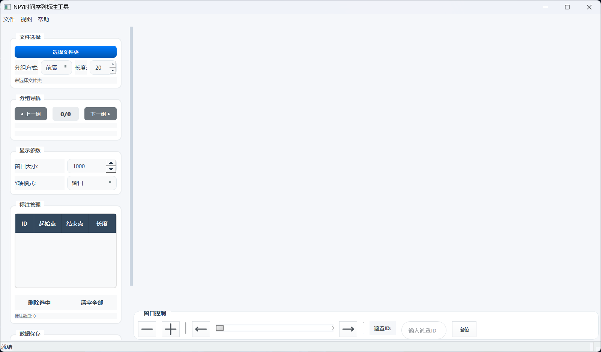
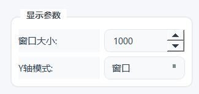
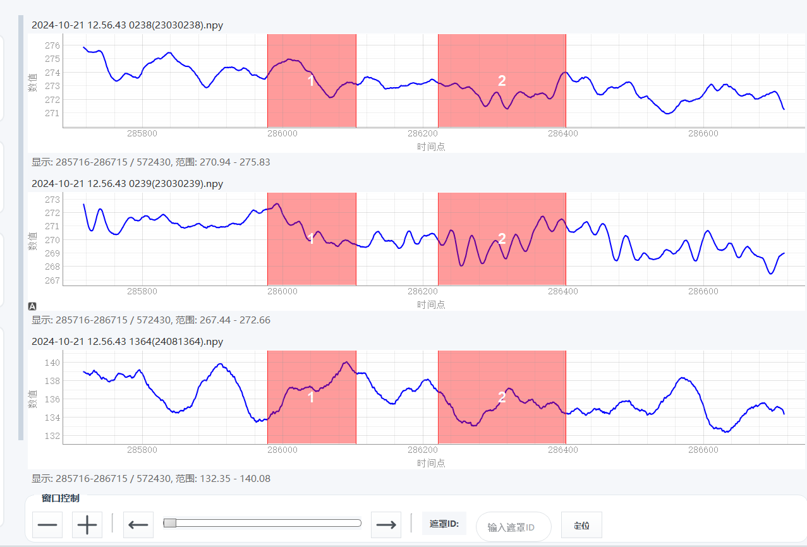
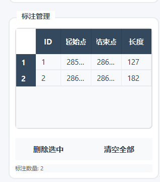
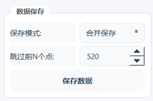

# NPY 标注工具

这是一个用于标注NPY格式时序数据的图形化工具。

## 功能特性

- **数据可视化**：以图表形式展示NPY数据，支持缩放、平移等交互操作。
- **分组管理**：支持将多个NPY文件按需分组，方便批量处理和比较。
- **灵活标注**：通过鼠标交互在图表上进行区域标注，并实时显示标注结果。
- **多种保存模式**：支持将标注数据合并保存或按文件分别保存。
- **可配置选项**：提供多种配置选项，如跳过点数、窗口大小、Y轴显示模式等。

## 安装指南

### 环境要求

- Python 3.x
- PyQt5
- NumPy
- pyqtgraph

### 安装步骤

1.  **克隆或下载项目**

    将项目代码下载到本地。

2.  **安装依赖**

    打开终端或命令行，进入项目根目录，然后运行以下命令安装所需依赖：

    ```bash
    pip install PyQt5 numpy pyqtgraph
    ```

## 操作说明

##### 启动应用

在项目根目录下运行以下命令启动应用程序：

```bash
python main.py
```

##### 加载数据




-   点击“选择文件夹”按钮，选择包含NPY文件的文件夹。
-   工具会自动扫描并加载文件夹中的所有NPY文件。
-   此处可以打开多个NPY文件，根据前缀或者后缀名字相同的个数，如想打开所有前缀为data的NPY文件，那就可以选择前缀长度为4。

##### **分组与浏览**



-   加载完成后，文件会根据前缀/后缀名称进行分组，相同前缀/后缀为一组。
-   可以通过“上一组”和“下一组”按钮在不同分组间切换。
-   一个分组中多个文件操作是同步的
-   窗口大小为一个窗口显示的点数，y轴模式是一个窗口是按照窗口最值分布还是整个文件的最值分布，窗口大小也可以在图标下方的+-符号进行改变，同时也可以前后拖动查看不同位置的数据
-   遮罩id可以根据遮罩标记快速定位（有bug不要用）


##### **数据标注**



-   在图表上按住鼠标左建立遮罩，再点击左键确认遮罩，再点击右键固定遮罩并将数据传入表格。



-   鼠标悬停在遮罩上可以拖动遮罩进行微调，同时遮罩会根据起始位置自动编号。
-   可以点击表格中的“删除”按钮来移除不需要的标注。

##### **数据保存**



-   在“数据保存”区域，可以选择“合并保存”或“分别保存”模式，合并保存会把三个数组合并为一个二维数组。
-   可以设置“跳过前N个点”来忽略数据开头的噪声点。
-   点击“保存数据”按钮，选择一个目录来保存标注结果。
-   保存后会生成一个文件夹，包括合并后的数据，标签数组（对应这遮罩位置会生成和ID一样的数字，其他位置都是0），时间戳（这里就是序号）

## 文件结构

```
NPY_Annotation_Tool/
├── core/               # 核心逻辑模块
│   ├── annotation_engine.py  # 标注引擎
│   ├── data_manager.py       # 数据管理器
│   └── file_scanner.py       # 文件扫描器
├── ui/                 # UI界面模块
│   ├── control_panel.py      # 控制面板
│   ├── main_window.py        # 主窗口
│   └── plot_widget.py        # 绘图组件
├── main.py             # 程序入口
└── README.md           # 项目说明文档
```